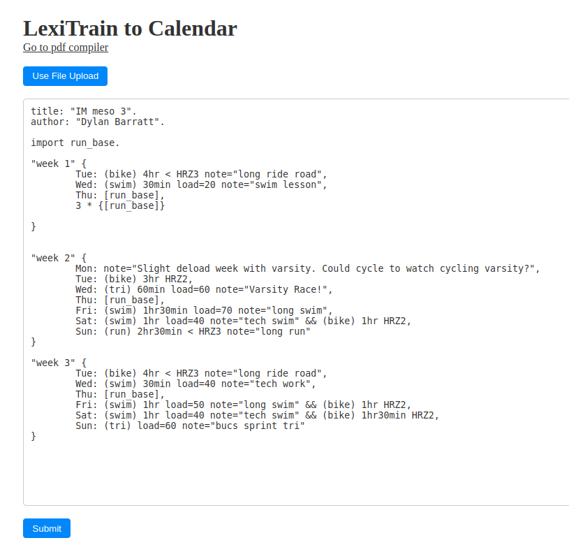
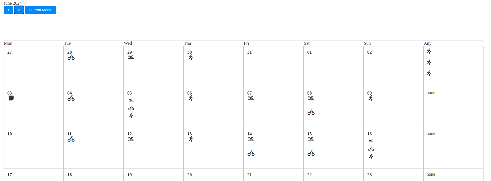

# LexiTrain project
LexiTrain was created as a dissertation project in my final year as a computer science undergraduate at Swansea University.
The full dissertaion can be read [here](./dissertation.pdf).

The project source is split into three parts: the ANTLR code, the website compiler code, and the documentation code.

## Running ANTLR code
In the Examples directory, the test.sh file will run the test file in ANTLR/examples with the specified grammar. ([ANTLR](https://www.antlr.org/download.html) needs to be installed to run this)

## Running the WEB compiler code
The web code is run using [Node](https://nodejs.org/en/download/). The first time will need an npm install (`npm i`).
`npm run dev` will locally run a development build for testing

## Running the documentation
A compiled version is [here](./DOCS/site/).
mkdocs needs to be installed for a fresh compile [mkdocs](https://www.mkdocs.org/user-guide/installation/) & [mcdocs material](https://squidfunk.github.io/mkdocs-material/getting-started/)
The host_site.sh script can be run to serve the documentation on an ubuntu apache server (works on my Ubuntu 24.04 LTS pc).
