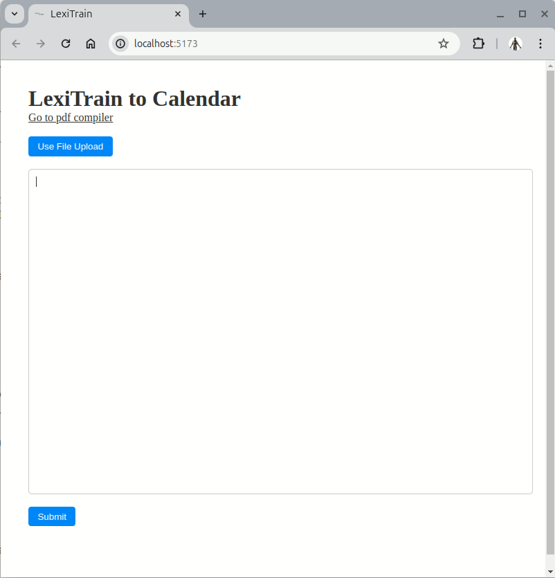

<br />
<p align="center">
  
</p>
<br />
<br />

## About
LexiTrain is a formal language used to describe training plans for endurance athletes, enabling the compilation of detailed and attractive training plans.
LexiTrain was created as a dissertation project in my final year as a computer science undergraduate at Swansea University.
The full dissertaion can be read [here](./dissertation.pdf).

The project source is split into three parts: the ANTLR code, the website compiler code, and the documentation code.

## Demo


## Tools Used
<p>
  
  <a href="https://www.antlr.org/">
    ANTLR 4
  </a>
</p>

<p>
  
  <a href="https://svelte.dev/">
    Svelte
  </a>
</p>

<p>
  
  <a href="https://www.typescriptlang.org/">
    TypeScript
  </a>
</p>


## Running ANTLR Code
In the Examples directory, the test.sh file will run the test file in ANTLR/examples with the specified grammar. ([ANTLR](https://www.antlr.org/download.html) and Java needs to be installed to run this)

Download the ANTLR lib to the correct place for the test.sh file:
```sh
cd /usr/local/lib 
curl -O http://www.antlr.org/download/antlr-4.0-complete.jar
```

## Running the WEB Compiler Code
The web code is run using [Node](https://nodejs.org/en/download/). The first time will need an npm install (`npm i`).
`npm run dev` will locally run a development build for testing


## Running the Documentation
A compiled version is [here](./DOCS/site/).
mkdocs needs to be installed for a fresh compile [mkdocs](https://www.mkdocs.org/user-guide/installation/) & [mcdocs material](https://squidfunk.github.io/mkdocs-material/getting-started/).
The host_site.sh script can be run to serve the documentation on an ubuntu apache server (works on my Ubuntu 24.04 LTS pc).

